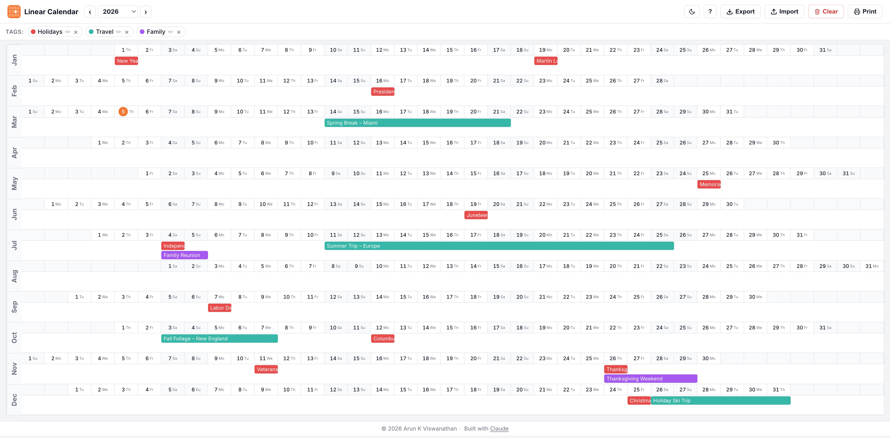
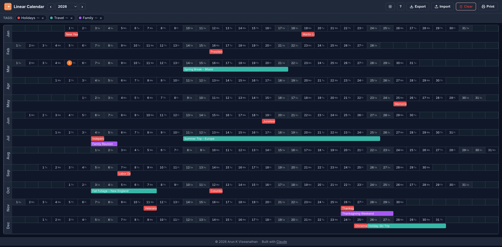

# Linear Calendar

An open source linear calendar application

Try it out at https://linearcalendar.element77.com

[](LICENSE) [](https://app.netlify.com/projects/polite-banoffee-bc527c/deploys)

---

## What is a Linear Calendar?

A linear calendar displays time sequentially in a straight line, unlike traditional grid-based monthly views, to better visualize the continuous flow of days, weeks, or an entire year.

The concept was popularized by [Nick Milo](https://www.linkingyourthinking.com/) of *Linking Your Thinking* (LYT), who introduced the linear calendar as a core planning tool in his YouTube video [*The Most Useful Calendar View in 2025 That No One Told You About*](https://www.youtube.com/live/SQHYj7x-t3A).

---

## About This Project

This project provides an open source implementation of a linear calendar. It aims to make it easy to generate, display, and interact with year-specific calendar data programmatically.

### Features

- [x] Generate a full linear calendar for any given year
- [x] Fully local to your browser and relies on no backend
- [x] Able to color code and tag events, including dark mode support
- [x] Export and import in .ics format

---

## Screenshots

### Light Mode


### Dark Mode


---

## Developer Notes

### Prerequisites

- [Node.js](https://nodejs.org/) ≥ 18

### Install dependencies

```sh
npm install
```

### Run the dev server

```sh
npm run dev
```

Opens at http://localhost:4174 with hot module replacement.

### Build for production

```sh
npm run build
```

Output is written to `dist/`.

### Preview the production build

```sh
npm run preview
```

Serves the `dist/` folder at http://localhost:4173.

### Code Quality

```sh
# Run all checks (lint + format + test)
npm run analyze

# Individual checks
npm run lint          # ESLint for code quality and security
npm run lint:fix      # Auto-fix ESLint issues
npm run format        # Format code with Prettier
npm run format:check  # Check formatting without changing files
```
